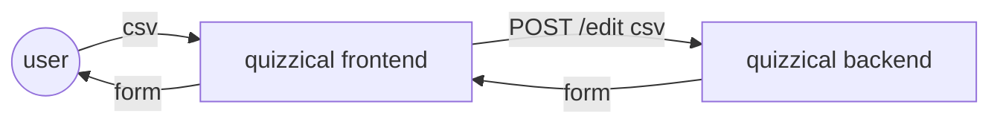
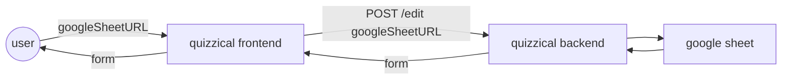
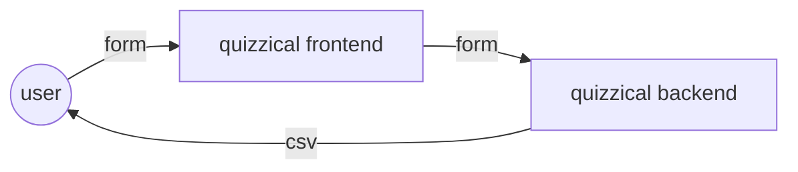
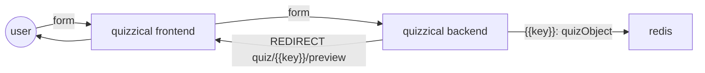
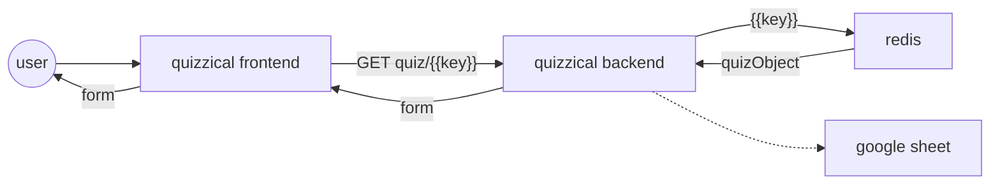
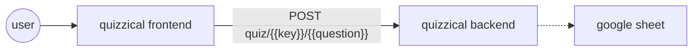

# Quizzical
## Functionalities
### Question editting
- Provides a UI for user to edit their quiz questions
- Provides a way for users to start their quiz bank from scratch
### Question I/O
- Allows users to import quizzes from csv (or sheets)
- Allows users to download quiz into csv
### Quizzing functionality
- Renders questions for users
- Renders questions in a kahoot type quiz game
- Collect results and export them into csv

## User Flows
### Rendering from User csv

### Rendering from google sheet

### Exporting questions into CSV

### Preview questions

### Start a quiz

### Collecting results

## Architectural Decisions
### What are the decisions and why?
#### Frontend

**Current status**: a static page rendered using go templates

##### Advantages
- Comes included with Go standard lib
- UI can be customised easily by embedding css from others
- Minimal UI FE work required
- Currently seems enough to pass data back and forth

##### Disadvantages
- Not able to do cool front end stuff like the games interface in Kahoot
  - Perhaps can explore using HTMX or something
- Still basic HTML looking pages, nothing like cool modern pages

#### Backend
**Current status**: Basic go server, no frameworks

##### Advantages
- Lightweight and simple
- Builds and works nicely with render.com
- Nice testing ecosystem

##### Disadvantages
- Lots of code to write

#### Database (or lack thereof)
**Current status**: Google sheet + Redis cache + user submits CSV

##### Advantages
- Less infrastructure to take care of
- No one is going to use this anyways
- Data can be easily seen
- Caching helps with latency issues
- Most people are comfortable with sheets

##### Disadvantages
- Communication with google sheets is slow (latency issues v.s. db)
- Not sure how much data can we store in gSheets
- Inconsistencies in data structure read in from gSheets
- Brittle data: 1 wrong format can throw everything off
